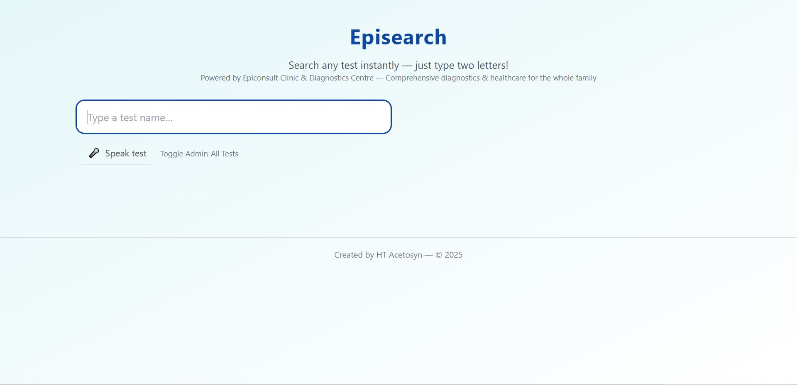

# 🩺 **EPISEARCH** – Fast, Simple Medical Test Search  

> **Browse categories, check prices, find your test in seconds.**  

---

## 📸 Demo Screenshot

[](static/images/episearch.JPG)


## 🚀 **About**  
**EPISEARCH** is a lightweight Flask web app that helps patients:  
- Search for medical tests instantly  
- Browse all test categories (📋 categories are **BOLD CAPS** in display)  
- View accurate, up-to-date prices  

The app loads test data from a CSV, converts it to JSON for faster search, and displays results in a clean, user-friendly interface.

---

## ✨ **Features**
- 🔍 **Instant search** for any medical test  
- 📂 **Category browsing** for all available tests  
- 💰 **Accurate price display** for each test  
- 🎤 **Voice search** support (Chrome recommended)  

---

## 🛠 **Quick Start**

### 1️⃣ Create a Virtual Environment & Install Dependencies
```bash
python -m venv .venv
source .venv/bin/activate  # Windows: .venv\Scripts\activate
pip install -r requirements.txt
